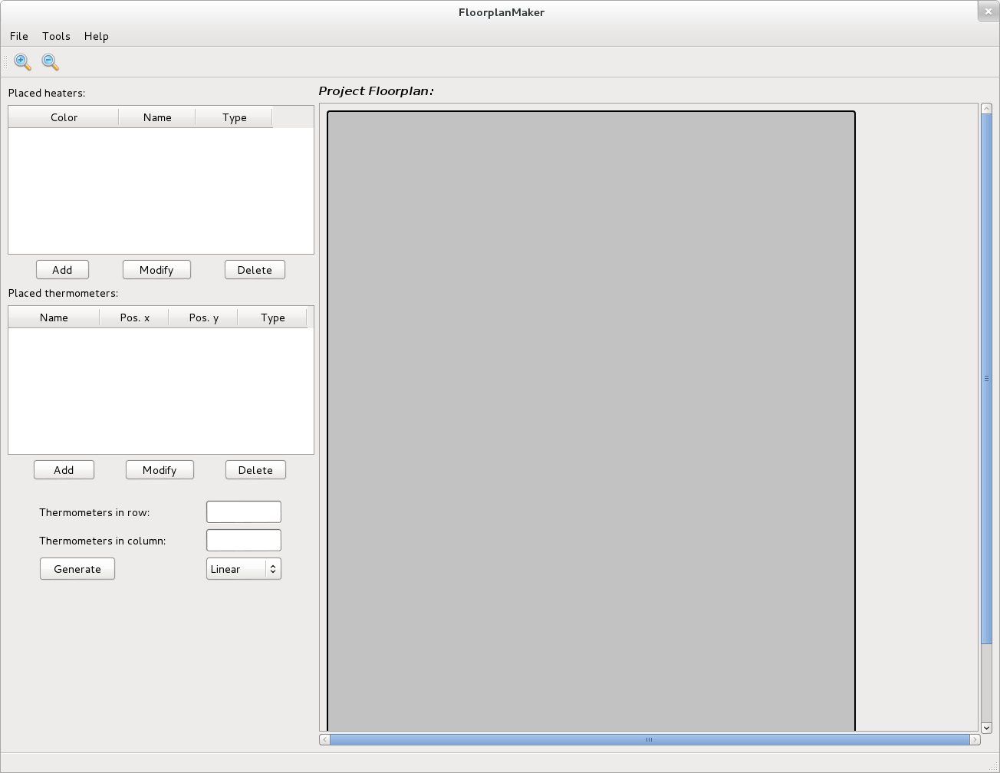
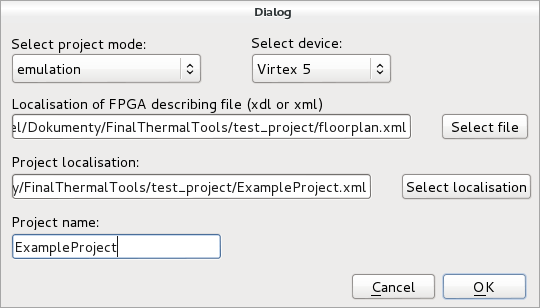
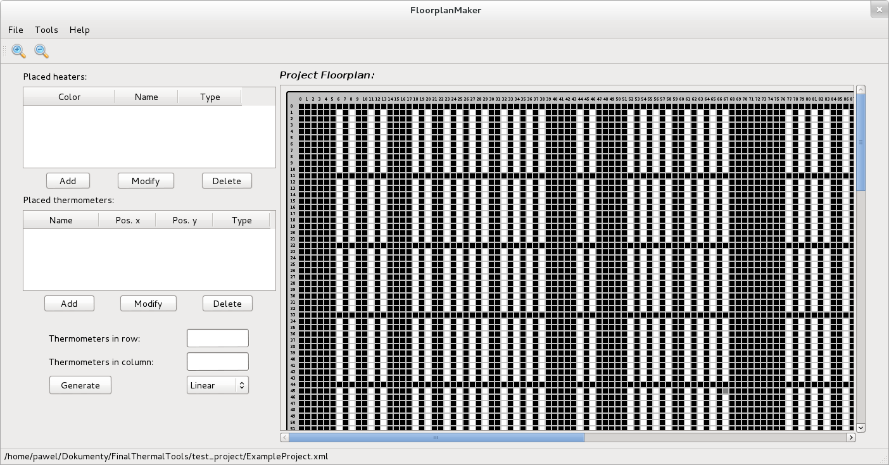
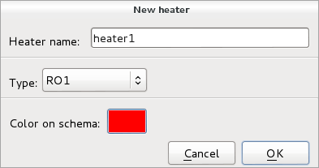
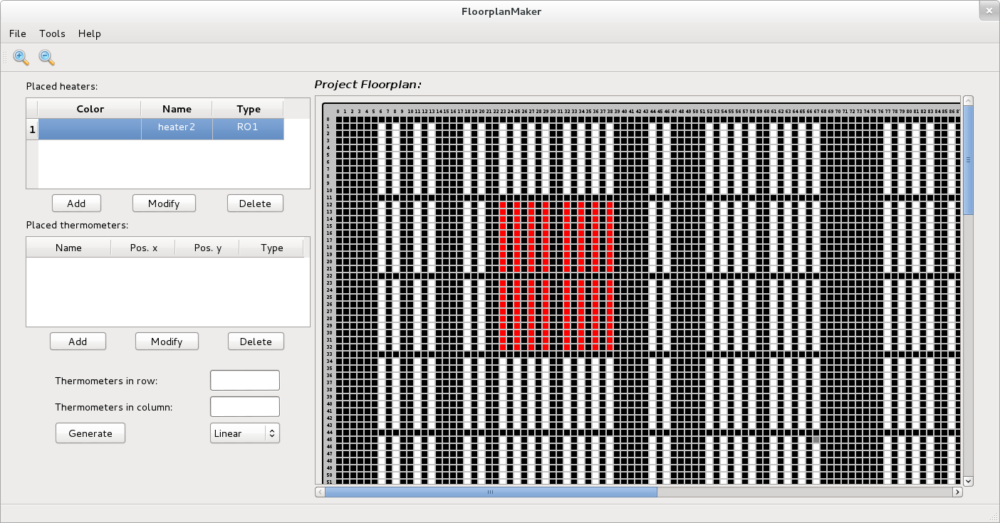
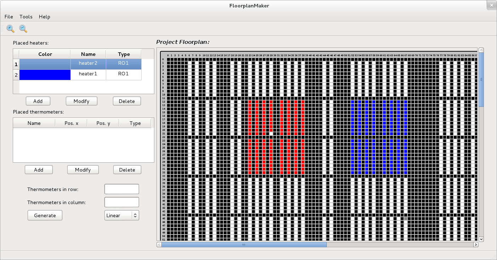
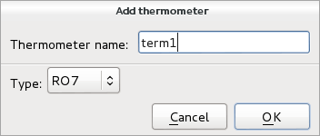
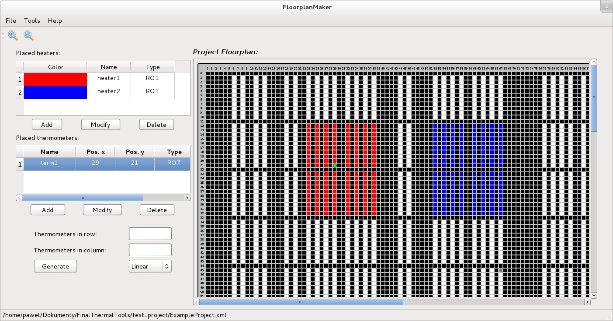
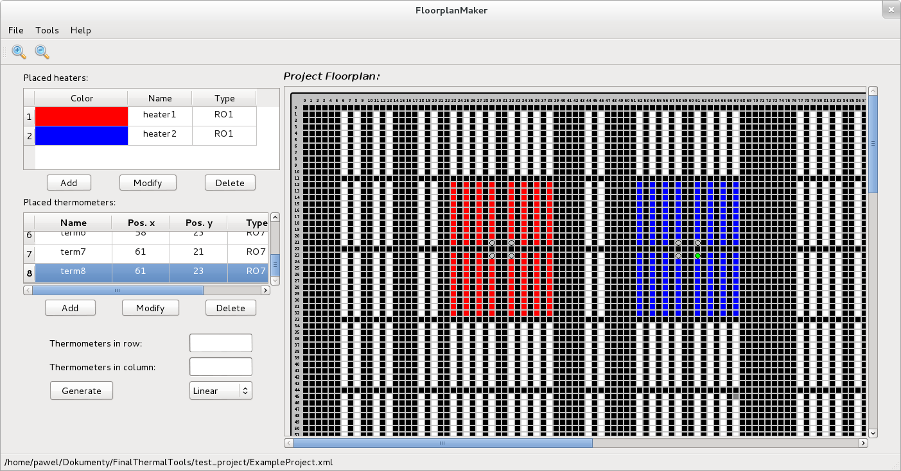
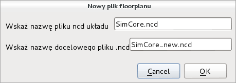

###############
Getting started
###############

************
Requirements
************

The specified below requirements are **tested** and **verified** settings in
which the software was used, if there is newer software versions or other setup
on which it runs please do not hesitate to infrom us. We will update the current
information.

    - Xilinx ISE version 13.3 or newer
    - Rapidsmith in version 0.5.0
    - MongoDB 2.6.10
    - Qt and PyQt4
    - Java JDK 7
    - pyserial
    - Python 2.7
    - Python setup tools
    - Linux

************
Installation
************

This section describes in details the installation of all of the tools.

.. warning:: All of the steps in this instructions are fitted to Debian-like
             Linux distributions. If you use another Linux OS please customize
             the instructions to your system.

JGenerilo
=========

1. Before you strat install JGenerilo be sure that you have already installed
   the newest `Java JDK`_, `MongoDB`_ (2.6.10), `Xilinx ISE Design Suite`_
   (>13.3) and `Rapidsmith`_ (0.5.0).

.. _Rapidsmith: http://rapidsmith.sourceforge.net/
.. _Java JDK: http://www.oracle.com/technetwork/java/javase/downloads/index.html
.. _MongoDB: https://www.mongodb.org/
.. _Xilinx ISE Design Suite: http://www.xilinx.com/products/design-tools/ise-design-suite.html

.. important:: ISE design studio Webpack is limited only to be used with
               Spartan family devices free of charge. If you want to use 
               our tools with Virtex family devices you need full-version 
               of ISE design studio.

2. To install JGenerilo first visit our repository site on `GitHub`_. And copy the
   repo url:

.. code-block:: bash
    
    $ git clone https://github.com/ComputerArchitectureGroupPWr/JGenerilo.git

3. After repository is cloned go to JGenerilo directory 

.. code-block:: bash

    $ cd JGenerilo

4. Before you start build the project please check if Maven is installed:

.. code-block:: bash
    
    $ mvn --version

5. If Maven is installed go to next step. If command was not found please install Maven:

.. code-block:: bash

    $ sudo apt-get install maven.

6. After Maven is successfully installed we can proceed JGenerilo installation.
   First step is to build JGenerilo package. The JGenerilo application need
   some dependencies, unfortunately Jambi Qt isn't available in the official
   maven repository so you have to install it by yourself. To do this please
   follow the instructions below:

    a) First go to Qt Jambi sourge forge `site`_ and download proper version
    depend on your system type. Please note that you should use the `4.6.3`_
    release for JGenerilo.

    b) After you get proper jar file with Qt Jambi please add it to your local
    maven repository:

.. _site: http://sourceforge.net/projects/qtjambi/
.. _4.6.3: http://sourceforge.net/projects/qtjambi/files/4.6.3/

.. code-block:: bash

    $ mvn install:install-file "-Dfile=qtjambi-4.6.3.jar" "-DgroupId=com.trolltech" "-DartifactId=qt" "-Dversion=4.6.3" "-Dpackaging=jar" "-DgeneratePom=true"

7. When all dependencies are satisfied the JGenerilo package can be build. To do
   this please type **two times**:

.. code-block:: bash
    
    $ mvn compile assembly:single

8. After compilation and building a package in *target* you should find several
   archives and one jar file. Go to target directory.

.. code-block:: bash

    $ cd target

9. On this stage in the target directory you should find several archives
   JGenerilo-VERSION-SNAPSHOT-bin. Please extract one of it eg.

.. code-block:: bash

    $ unzip JGenerilo-0.1a-SNAPSHOT-bin.zip

10. For installation was prepared a python script install.py. This script
    install the JGenerilo jar with dependencies in **\\usr\\local\\JGenerilo** and
    creates execution script which is added to the path. To install the
    JGenerilo please type in command shell:
   
.. code-block:: bash

    $ sudo python install.py

11. After installation reload your shell to update PATH e.g.:

.. code-block:: bash

    $ bash

12. Check if JGenerilo was successfully installed. Type:

.. code-block:: bash

    $ JGenerilo -h

FloorplanMaker
==============

1. Before you start install FloorplanMaker please check if following packets
   are installed in your system:
    
    - Qt4
    - PyQt4
    - Python2.7
    - Python setup tools

2. If yes go to 3-rd step else please install it using your packet menager eg.:

.. code-block:: bash
       
    $ sudo apt-get install python python-qt4 python-setuptools

3. To install FloorplanMaker first visit our repository site on `GitHub`_. And
   copy the repo url:

.. code-block:: bash
       
    $ git clone https://github.com/ComputerArchitectureGroupPWr/Floorplan-Maker.git

4. Go to Floorplan-Maker directory:

.. code-block:: bash
       
    $ cd Floorplan-Maker

5. To install FloorplanMaker just type:

.. code-block:: bash
       
    $ sudo python setup.py install

6. To confirm if installation goes correct type:

.. code-block:: bash
       
    $ FloorplanMaker 

7. And check if the windows opens.

Simulio
=======

1. To install Simulio first visit our repository site on `GitHub`_. And
   copy the repo url:

.. code-block:: bash
       
    $ git clone https://github.com/ComputerArchitectureGroupPWr/Simulio.git

2. Go to Simulio directory:

.. code-block:: bash
       
    $ cd Simulio

3. To install Simulio just type:

.. code-block:: bash
       
    $ sudo python setup.py install

4. To confirm if installation goes correct type:

.. code-block:: bash
       
    $ simulio

5. And check if simulio response.

SimulationCore
==============

1. SimulationCore is soft controller for target emulation FPGA device. Here
   is no installation need. However these files are necessary in final
   hot-floorplan deployment.

2. To clone SimulationCore repository site on `GitHub`_. And copy the repo url:

.. code-block:: bash
          
    $ git clone https://github.com/ComputerArchitectureGroupPWr/SimulationCore.git

3. Now we are ready to create first project.

.. _GitHub: https://github.com/ComputerArchitectureGroupPWr

**********
Fast start
**********

.. note:: In this example we use Xilinx XUPV5-LX110T Evaluation Platform

1. First add Xilinx ISE to path (remember to replace XX by 64 or 32 system bit version):

.. code-block:: bash

    $ source /opt/Xilinx/13.3/ISE_DS/settingsXX.sh

2. Add Rapidsmith to path e.g.:

.. code-block:: bash

    $ export RAPIDSMITH_PATH=/opt/rapidSmith

3. Now you are ready to create fpga description of used FPGA. Let's start from
   creating project dictionary. In cloned SimulationCore repository you find
   examples directory and in it test_project. Please copy this directory into
   your current workspace:

.. code-block:: bash

    $ cp -r $SIMULATION_CORE_PATH/examples/test_project first_emulation

4. In this folder you should find two files ``SimCore.ncd`` and ``EmulationProgram.xml``.
   To create hot-floorplan first you have to create ``floorplan.xml`` file with
   current device description.

.. code-block:: bash

    $ JGenerilo -d SimCore.ncd virtex5

5. After previous step in current project directory you should find ``floorplan.xml``
   file. Now you can create your first hot-floorplan. To do this open FloorplanMaker

.. code-block:: bash

    $ FloorplanMaker

6. Now you should see FloorplanMaker window as below. To create new project click
   File -> New project.

7. New project dialog is showed below. Select ``emulation`` mode and
   ``Virtex5`` device.  As describing file use ``floorplan.xml`` file created
   before by **JGenerilo**. As project localisation choose directory where
   ``floorplan.xml`` is located and type your project name. Click ok.

8. If project was successfully create you should see FPGA matrix in *Project Floorplan*
   area. Let's start and create heater. Click ``Add`` below heater table.

9. You should see heater new dialog. Fill heater information and click ok.

10. After you add new heater you should see your new heater added both to
    heater table and to Floorplan view like below. Now you can add more heaters
    the same way.

11. After all heaters are added you can start adding thermometers. Probably you
    would like add thermometer somewhere inside heater. To do this select
    heater in heater table, and click right mouse button over one of heater
    block.  The block should be now empty as on image below. 
   

12. Add new thermometer by clicking ``Add`` button below thermometers table.
    New thermometer dialog should appear.

13. Click ok and add thermometer in empty block by clicking it two times. Green
    circle should appear as on image.

14. Now you can add using this steps more thermometers. The example final floorplan
    can be as follow:

15. The last step is creation of **JGenerilo** input file. Click ``tools`` ->
    ``Create generilo file``. If you don't change the ``ncd`` file name then
    default values are fit. Click ok.

16. Close **FloorplanMaker**. In your project directory you should find now
    two new files: ``YourProjectName.xml`` *FloorplanMaker project file* and 
    ``generilo.xml`` and *control file for JGenerilo*. Now you are ready to
    create final bitstream with your hot-floorplan. To perform this action
    type:

.. code-block:: bash

    $ JGenerilo -g generilo.xml virtex5

17. If everything goes right in current project directory you should find two
    new files ``*.ncd`` and ``*.bit``. Program FPGA using Xilinx **impact**
    tool.

18. If programing FPGA goes well, create ``program.xml`` file with simulation
    program. An example of such file is presented below.

.. literalinclude:: _static/code_examples/simulio.xml
   :language: xml
   :caption: **Listing: Example of XML emulation program file**
   :name: simulio.xml

19. When FPGA is programmed and simulation program is ready you can start the
    emulation process, type:

.. code-block:: bash

    $ simulio -p /dev/ttyUSB0 -c program.xml

20. Simulation will stop after time declared in program.xml or after ``Ctrl+c``.

21. In ``data.csv`` you should find results.

.. note:: The results are in fact oscillations of seven stage ring oscillator 
          in one period of 3 kHz clock.

*******
Summary
*******

This way user have ready example project. For more sophisticated usage we
attach also documentation to all control files in next section. In next
revisions we will add also full code documentation to JGenerilo for use
to extend it behavior and functionality.
