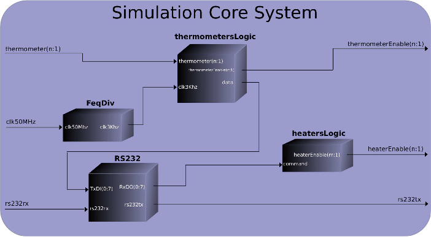

##########################
General info about toolset
##########################

This chapter describes designed project tools which creates floorplans for
thermal emulations. The created toolset consists of **FloorplanMaker**
(FM) which is Graphical User Interface (GUI) for creating **emulation
floorplans**. This tool provides user graphical representation of the FPGA
design with emulation controller and the information about available resources
for both heaters and thermometers implementation. User floorplan is stored in
form of *XML* file. Second tool is **JGenerilo** (first version of
tool was written in Python using FDAT, the current version is JGenerilo written
in Java and it exploits Rapidsmith). Generilo uses produced by FM xml
floorplan description to place and route both heaters and thermometers. In
figure below is showed the placement of created tools in flow of
implementing the final bitstream for thermal emulation.

.. figure:: _static/figures/JGenerilo.png 
   :scale: 80 % 
   :align: center

In this flow thermal emulation controller (the emulation controller is not a
part of this project and would not be described in this work) is implemented
using standard Xilinx implementation flow from HDL files. My toolset uses
design in form of NCD file which is produced finally by PAR tool. The NCD file
is translated into XDL file by XDL tool. Then XDL file is processed by Generilo
tool. Generilo husks the information about the tiles and theirs eventual
exploitation. Produced in this way xml file is further processed by FM for
representing resources of FPGA in form o tiles. Tiles compatible with
thermometers and heaters are avialable for user to create hot floorplan. FM
finally produces an XML file with placement description of heaters an
thermometers. This file is used by Generilo tool to produce final netlist in
form of XDL. This XDL is further translated into NCD file, the route between
both heaters and thermometers on one side and the thermal controller is added
by Xilinx PAR tool. After the netlist is finished bitgen produces the bitstream
which can is loaded into FPGA device for carry out the thermal emulation. The
more detailed description of the toolset implementation and architecture is
provided in following sections.

************************************
JGenerilo - hot-floorplans generator
************************************

JGenerilo is the most important tool in whole toolset. It is designed to
synthesize and deploy the real silicon device as set of heaters which will
emulate the thermal behavior of restored circuit. Beside heater blocks
JGenerilo generates also set of thermometers to collect the thermal data for
final thermal behavior modeling. JGenerilo uses Xilinx XDL language to implement
following functionalities:

    - **Design analysis** - JGenerilo analyze specific FPGA resources and
      produces compressed description of available resources for different
      types of heaters and thermometers. Description is available in two forms:
      text which is displayed directly in command line and in XML file form
      which can be further used by customized user tools or by FM for emulation
      floorplaning.

    - **Netlist mapping** - JGenerilo reads the design netlist with prepared
      heater or thermometer and map it into form of macro in JGenerilo elements
      database.

    - **Design generation** - using emulation floorplan description provided by
      FM it produces the final netlist for emulation purposes in XDL file form.

In following sections we try to explicit the described above functionalities.

Design analysis
---------------

Before the floorplaning process can be pursued it is essential to analyse both
target device and the design with emulation controller. *JGenerilo* is able to
do this two things. Using Device API, *JGenerilo* analyses and produces the
description of available resources on target device. In
Listing below is showed slice of *XML device description* file
which is produced by *Generilo*. File starts with root element ``device`` which
describes version of file and the name of device for which was produced. First
child element ``size`` determine the dimensions of specified device.  Example
device *Virtex5 LX110T* has ``164`` columns and ``177`` rows.  Successive
element ``clbsize`` indicates the physical size of logical blocks in device.
This information can be used to modeling simulation.

.. literalinclude:: _static/code_examples/floorplan.xml
   :language: xml
   :caption: **Listing: Example of XML device description file for Virtex LX110T FPGA**
   :name: floorplan.xml

Next child elements named ``obstacles`` describes the position of FB which are
different type than CLB: *I/O blocks*, *interconnect tiles*, *DCM blocks* and
others which cannot implement user logic. Consecutive elements are ``units``.
Those elements describes CLBs used to implements logic connected with emulation
controller. Similarly to ``obstacles``, ``units`` blocks are unusable for
implementing the emulation floorplan, however their are specially indicated to
tell user the position of emulation controller which can affect the emulation
process by sharing routing resources or by heating it up since to close
position.

Netlist mapper
--------------

This section describes *Netlist mapper* functionality of *Generilo*. Design
netlist ``NCD`` is first translated to XDL by Xilinx ``XDL`` tool. *Netlist
mapper* loads also FPGA fabric however here it is processed by Rapidsmith which
creates object of device. Design netlist is here loaded by ``Design class``
which creates object with design object.  As well as in Python version of tool
also here module called *Config detector* search for module or instance and
provides netlist for MongoDB using *Jongo* framework. Finally, *Netlist mapper*
produces a MongoDB object and stores it in Mongo Database.

The *Netlist mapper* provides two ways for storing the designed components. The
first is a Python recipe generated by Recipe creator module.  Module stores the
component configuration and netlist in a regular Python file as a class with
standard component methods for interfacing the stored netlist.  Second method
relies on Jongo framework that maps the netlist to JSON file to store it in
Mongo Database as an object.

Component netlist is stored using non-SQL database *MongoDB* and Jongo
framework to map netlist into *JSON* file. The structure of such file is in
fact consisted with XDL hierarchical structure. Non-SQL structure of this
database allows to store object with different structure what facilitates the
way of storing different instances or modules. Jongo allows to create object
mapper which facilitates conversion from and to MongoDB.

Design generation
-----------------

Steps presented in previous sections prepared ``XDL`` component definition
required for the generation of multiple component instances and their placement
in FPGA fabric and the placement description generated by ``FM``. In current
step a component of ``JGenerilo`` tool called ``JGenerilo Design Generator``
(GDG) inserts components into the FPGA design. The operation of the tool is
controlled by the ``XML`` control file (FM result) that specifies what and
where to put, i.e. indicates the number of instances of each component and
their position (Detailed description of this file is provided in section
FloorplanMaker). ``GDG`` inserts the specified instances of components into
selected positions in the design and invokes bitstream generation.

.. figure:: _static/figures/generilo.png
   :scale: 100 % 
   :align: center

Workflow of ``GDG`` is presented on figure above and is identical for both
version of *Generilo*. The ``XML`` control file contains information about
device type, design file to work on, list of components and location of their
instances. ``GDG`` parses this file and gets the necessary information to run
the design generation process. The tool loads required file and component
configuration from recipes or Mongo database depending on version. At the
pbeginning ``GDG`` takes the design ``NCD`` file, translates it to ``XDL``
format and then loads it to ``GDG Core`` through ``Design`` class.  ``Device``
class loads the device description file and provides it to the main core.

The ``GDG Core`` loads the necessary components’ configurations, replicates
components and places their instances. Information about the device structure
and design is used by the Core to check the correctness of proposed deployment
of instances and to generate the final ``XDL`` description.  Afterwards ``GDG``
uses Xilinx's tools to translate modified ``XDL`` file to ``NCD`` file, route
inserted instances with control unit and finally produce the bitstream.

**********************************************
FloorplanMaker - GUI for hot-floorplans design
**********************************************

This section describes the *FloorplanMaker* (FM). ``FM`` is a graphical
front-end for the *JGenerilo* toolkit that allows for easy manipulation of
placement of components in the FPGA fabric. ``FM’s`` GUI is presented on figure
below. The tool has four main areas: menu, heater list, thermometer list and
FPGA fabric preview used for placement of heaters and thermometers. Menu File
is used to create new project, load existing one and save current project. Menu
Tools allows user to create an ``XML`` file describing placement of components
that will be later used by ``Generilo Design Placer``. Here user can also
invoke the generation of final bitstream for a designed floorplan.

Heater list contains all the instances of heating components defined by user.
The list contains groups of heaters with the information about their name,
color which distinguishes  them on the FPGA preview area and type. Colors help
user in easy recognition of the heater groups placement. The list also contains
information about type of heaters in each group.  Similarly the second list
contains list of the  thermometers in the fabric. In contrast to heaters,
thermometers are one ``CLB`` components and occur individually on the
fabric. Thermometers are visualised in preview area as circles with red and
green colour. Green colour denotes the thermometer currently selected in the
list. The FPGA preview is interactive and supports placement of heater groups
by area selection as well as one ``CLB`` selection by simple one click on
desired block. Heaters and thermometers can be placed using left mouse button
and displaced by using right mouse button.

FM produces designed by user emulation floorplan in form of ``XML`` file which
is further used by *JGenerilo* tool. Root element of this file is ``board``
which contains keys ``device`` describes family for which floorplan is
designed, ``mode`` this keyword describes if the floorplan is for emulation or
mesurement of thermal behaviour of some functional design, ``version``
indicates revision of file. First child element is ``input``. It describes the
NCD netlist file to which the floorplan should be added. On the other side,
``output`` indicates target file which should be created after netlists
merging. Following elements are two heater descriptions. First one is
``heater1`` which is ``RO1`` type. In the body of heater description is
indicated the placement of the heater blocks over the FPGA. Two of such blocks
are placed respectively in 6-th column and 1-st row and 6-th column and 2-nd
row. The last element in this file is thermometer ``term1``. As well as in
heater case thermometer has defined position and type.

.. literalinclude:: _static/code_examples/floorplan.xml
   :language: xml
   :caption: **Listing: Example of XML emulation floorplan file for Virtex LX110T FPGA**
   :name: generilo.xml

*********************************************
SimulationCore - Thermal emulation controller
*********************************************

Emulation process is controled using designed **SimulationCore**, which is
responsible for manage the emulation process which consists of 3 parts:

    - controlling heaters system,
    - collecting thermometers readings,
    - transferring data between FPGA and computer.

Thermometers data and instructions for heaters are transferring through port
RS232. **SimulationCore** black box is presented on the fig.~\ref{SimCoreBB}.
Inputs are: $n$ signals from thermometers, clock signal (default 50 MHz), data
from RS232 and one line signal simulation reset. Output signals are:
thermometers enable, heaters enable and RS232 data output. I have to note that
both enable signals are hidden in VHDL. User adds them when he defines the
placement of heaters and thermometers. After that, the project tools routes
this signals with proper thermometers and heaters blocks.

Simulation Core contains four main modules and is presented on figure below:

    - **FeqDiv** - generator of the 3 kHz frequency signal
    - **thermometersLogic** - thermometers management module
    - **heatersLogic** - heater management module
    - **RS232** - black box module to service RS232

Modules **thermometersLogic** and **heatersLogic** manage the
principle function of the core which is the emulation process. Inside the
module **thermomethersLogic** we find the finite state machine which is
responsible for sending measurements data through RS232. There is also a
counter circuit which works independently to the state machine. This circuit
controls attached signal sending to thermometers, counting their frequency and
transfer results to state machine. **ThermometersLogic** transfers
measurement data permanently in 3 bytes packages. First byte contains
information about number of the thermometer. Next bytes contain measurement
result. On Figure below are visible two measurements from two
thermometers. Each of them shows 50 MHz frequency. The ``FF`` means 8191
oscillations from RO in time of 166 us.

The **heatersLogic** module consists of counter assigned to each heater and
comparator.  Comparators send signals powering up heaters. Independently works
the state machine which collects controlling commands from RS232 port and
editing values in registers ascribed to each heater.  Control commands and
measurements data alike have a form of 3-bytes packages. The first byte is an
initialize sequence valued ``10101010`` in binary or ``55`` in hex. The second
byte contains the number of the heater. Last byte inform the state machine
about the amount of power powering up heater. The power value is defined in a
range from ``0`` to ``255``. This range is normalized to range from ``0`` to
``100`` in my tool. On the figyre below is presented a command which disable
the heater number ``1`` and a command powering up to full power the heater no.
``2``.

***************************************
Simulio - PC emulation control software
***************************************

**Simulio** is a command line tool created to carry out the emulation process
on user design according to defined heating program. This program is described
in appropriative XML file show in listing below. In output tag user define the
file with readings. In heater tags user define the sequence program for each
heater indicate the power expressed in percentages and duration in times units
like seconds, minutes or hours.

.. literalinclude:: _static/code_examples/simulio.xml
   :language: xml
   :caption: **Listing: Example of XML emulation program file**
   :name: generilo.xml

Simulio takes this instructions as their argument in a emulation program
control XML file. Additionally tool takes second argument which is a path to
the RS232 port. Simulio is multi threads program which is asynchronously
operate the heater control and thermometer reading sequences. At the beginning
tool write out the whole simulation program in command line and during the work
write out attached program sequences like powering up heater. User uses Simulio
via command prompt: 

.. code-block:: bash

    $ simulio /dev/ttyUSB0 program.xml.

During the simulation Simulio writes all of the thermometers readings to log
file. User defines this file in output tag in the XML simulation program file.
Simulio checks the received readings and rejects invalid measurements.  Data
write to log file are in following format: time in second for start thermometer
*1 : measurement [. . . ] thermometer 2 : measurement*. Example data in log
file: ``0.23 1 : 225862 : 22653 · · · 125 : 22446126 : 22777``. If one of the
thermometer is not connected Simulio write received value 0.
